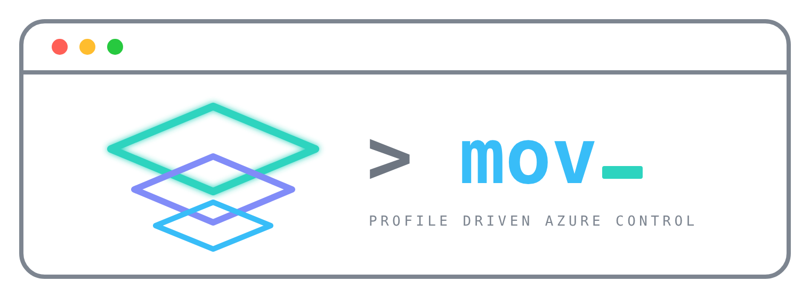

# mov-showcase



**Live: [mov-cli.duckdns.org](https://mov-cli.duckdns.org)**

An interactive map of [mov](https://github.com/Arelius-D/MOV-CLI). Three zones,
what sits in each, and what passes between them.

Click anything to read about it. Hover to see what it connects to. Type in the
filter to narrow the map.

## Running it

Open `index.html`.

No build step, no package manager, no framework, no network request at runtime.
Icons are inline SVG. Scripts are classic, not modules, because ES imports are
blocked over `file://`.

## Layout

```
index.html        markup
src/map.js        zones, groups, objects, arcs. All page content.
src/render.js     data to DOM
src/arcs.js       arc geometry
src/interact.js   hover, selection, panel, theme, zoom, filter
src/styles.css    tokens, reset, layout, components
verify/check.py   house rules
```

Everything on the page comes from `map.js`. Adding an object is one entry in
one array.

Arc paths are computed from where objects land, not from fixed coordinates. The
map survives a resize, a late font, or a new object. Each arc routes along
whichever axis its two ends are further apart on, and takes its own slot on the
edge it leaves from so arcs sharing an object do not stack.

Zoom scales one element. The stage is laid out at the inverse of the scale and
drawn at it, so the rendered width never changes and nothing overflows.

The filter matches two ways: substring over every field, and subsequence over
names, so `vnw` finds `vnet-novatrix-web`. A match brings its connections with
it.

## Checks

```
python verify/check.py
```

| Rule | |
| --- | --- |
| Colours | `oklch()` or a token. No hex, `rgb()`, `hsl()` or named colours. |
| Lengths | `rem`, `em`, `%`, `ch`. No `px`. |
| Specificity | No `!important`. |
| Tokens | Declared and used, both directions. Same set in every palette. |
| Copy | No reasoning-out-loud constructions in anything a visitor reads. |
| Map data | No arc to a missing object. No object in a missing zone or group. No empty group. No object without arcs. |

Checked by hand: keyboard navigation, both themes plus the system default,
narrow viewports, `prefers-reduced-motion`.

## Accuracy

Every value shown is one `mov` produced against a live subscription:
`rg-novatrix-v34`, `Standard_B2ts_v2`, `swedencentral`, a real HTTP probe. The
budget alert address is the one exception, replaced because this page is public.

## Licence

AGPL-3.0-only.
